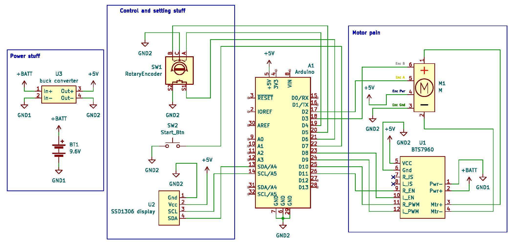

# hehe sci oly ev for lambert

### IMPORTANT
make sure to find address of SSD1306 display before using this script

### ok the rest of it

Hello so this is gonna be kinda pain honestly 🥲👍

Basically this ev will use cascading PID with an outer position loop and inner
velocity loop to precisely control the motor to move the right distance in the right time.

The path that the PID will try to match up with is a trapezoidal velocity-time profile,
with a constant acceleration period, a cruise period, and a constant deceleration period.

The mathematical setup for the calculations can be found in
[this](https://www.overleaf.com/read/zccntryzrtrq#407659) overleaf doc and the actual
result of the derivation can be viewed and verified
[here](https://www.desmos.com/calculator/avxj6yh4fy) on desmos.

*i am not showing the derivation itself btw that is too much work*

The target dist and time can be set on the vehicle itself with an ec11 w/ button similar
to how unphayzed can. both values are set digit by digit, and a press of the encoder button confirms
the selection for each digit. The values are displayed by an onboard SSD1306 display.

oh here is wiring diagram btw based on whats in the code rn

